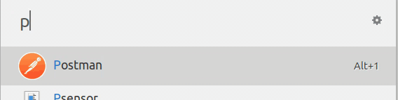

# Ulauncher Password Generator

[](https://ext.ulauncher.io/-/github-rkarami-ulauncher-password-generator)


> [ulauncher](https://ulauncher.io/) extension to generate self-signed passwords.

## Why?

Password generators usually work around making psudo-random strings. But how should we remember those random characters? Some suggest using a password storage service, but I don't beleive that they are totally secure and my passwords won't be leaked at all!

You can use this password generator because it uses your self-assigned `namespace` and `header` to make passwords that are generated for you with the specified `key`. There's no need to store these passwords, just remember your namespace and header, and use whatever key you like for each service (I suggest service-name, for example *gmail*) and you will have your passwords every where with you.

## Requirements

* [ulauncher](https://ulauncher.io/) > 5
* Python >= 3

## Install

Open ulauncher preferences window -> extensions -> add extension and paste the following url:

```https://github.com/rkarami/ulauncher-password-generator```

Go to preferences, update *namespace* and *header* and you are good to go!

## Usage




This extension supports the following keywords:

- **mode | m**: Tt select charset. Options:
  - ***alphanumeric | an*** : to use lowercase/uppercase alphanumeric characters
  - ***loweralphanumeric | lower | lan | ln*** : to use lowercase alphanumeric characters
  - ***alphabets | ab*** : to use only lowercase/uppercase alphabets
  - ***all*** : to use lowercase/uppercase alphanumeric characters + special characters
- **length | len | l**: to define password length
- **exclude | ex | e**: to exclude characters from charlist
- **include | in | i**: to include characters in charlist

## Contributing

Contributions, issues and Features requests are welcome.


## Show your support

<a href="https://www.buymeacoffee.com/h7NQu21WT" target="_blank"></a>

## License 

Copywright @ 2019 [Reza Karami](https://github.com/rkarami)

This project is [MIT](LLICENSE) Licensed.
